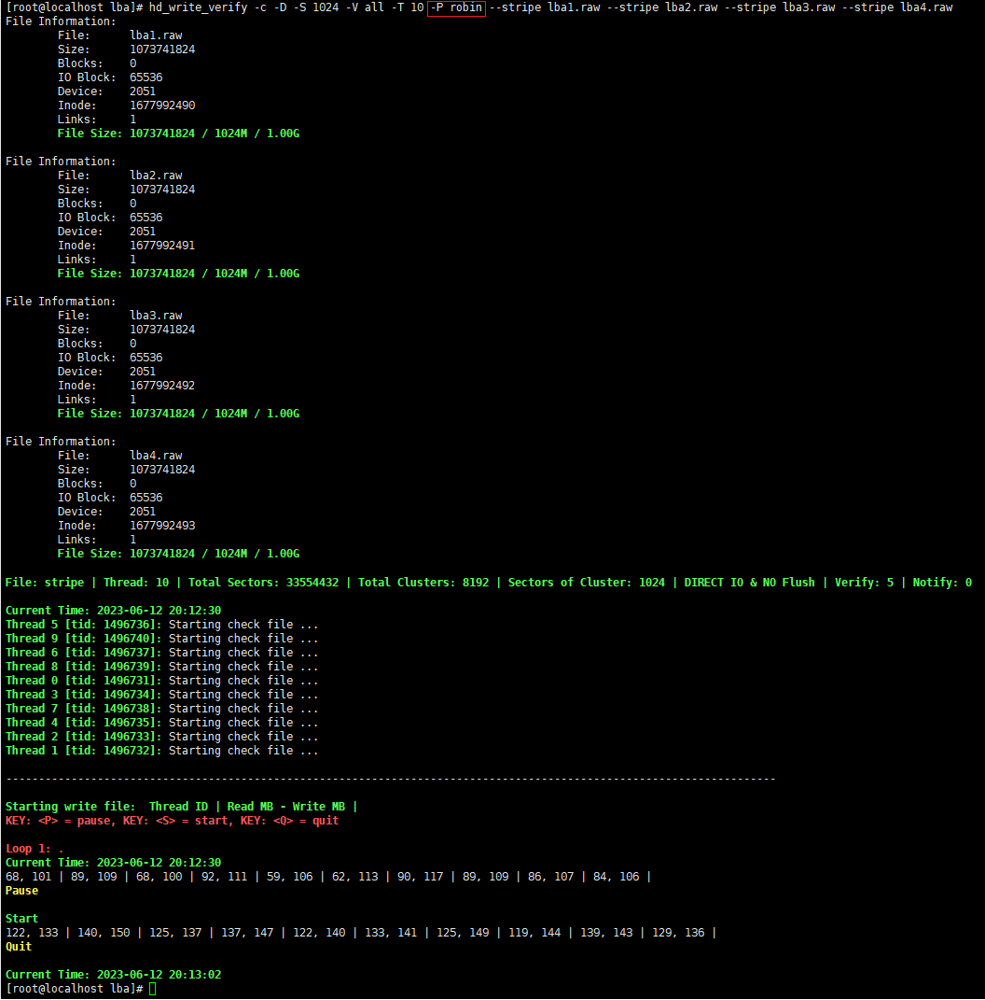
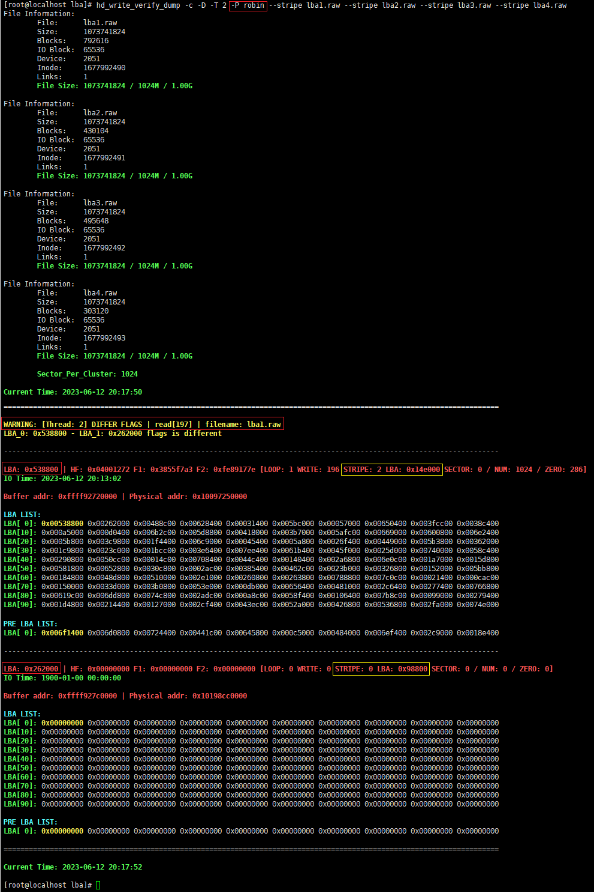
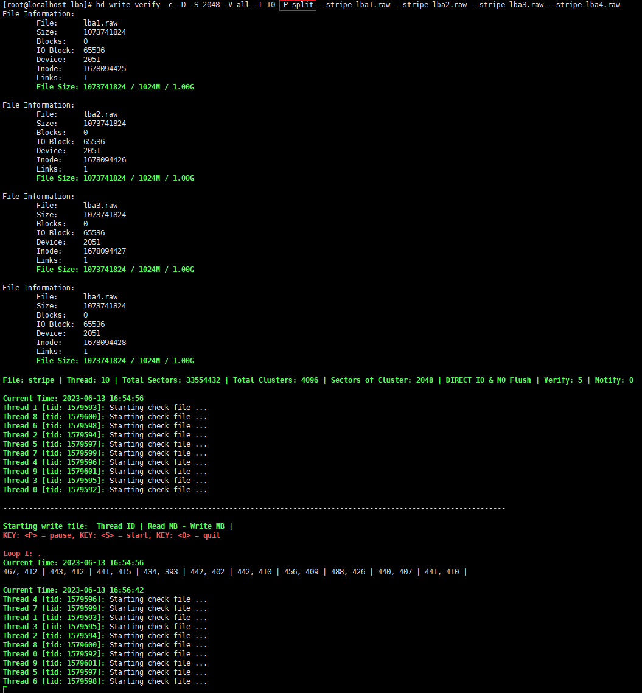
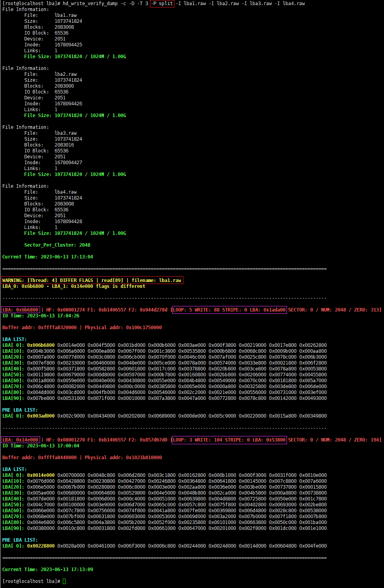

## YOUPLUS's tools

=========================================================================

# hd_write_verify & hd_write_verify_dump

Copyright (c) 2016-2023 YOUPLUS

Author: YOUPLUS(<zhang_youjia@126.com>)

hd_write_verify & hd_write_verify_dump is a tool for testing disk stability and verifying data consistency, for example:
physical disk: ide/sata/scsi/ssd/iscsi/fc/raid. virtual disk: loop/nbd/lvm/soft raid.
virtual machine disk: ide/sata/scsi/virtio-blk/virtio-scsi.

## Linux版本
`hd_write_verify / hd_write_verify_dump [opts] <disk|file>`

## Copyright & Data Layout

## LBA工具参数说明

## LBA工具输出说明

## LBA dump工具参数说明

## LBA dump工具输出说明

## LBA错误类型

## 条带策略：round-robin

## 条带策略：cluster-split

## 存储稳定性测试与数据一致性校验工具和系统

## 目录

## 展望

## Examples: (hd_write_verify)

## LBA Problem: BUG_001[1]

## LBA Problem: BUG_001[2]

## LBA Problem: BUG_001[3]

## LBA Problem: BUG_001[4]

## LBA Problem: BUG_002[1]

## LBA Problem: BUG_002[2]

## LBA Problem: BUG_002[3]

## LBA Problem: BUG_002[4]

## LBA Problem: BUG_003

## LBA Problem: BUG_004

## LBA Problem: BUG_005

## LBA Problem: BUG_006

## LBA Problem: BUG_007[1]

## LBA Problem: BUG_007[2]

## LBA Problem: BUG_007[3]

## LBA Problem: BUG_007[4]

## Examples: (hd_write_verify_dump)

## Windows版本

.png)

## 磁盘稳定性自动化测试

## linux文件条带测试
#linux条带测试：round-robin

#linux条带线程数据校验：round-robin

#linux条带测试：cluster-split

#linux条带线程数据校验：cluster-split

## windows磁盘条带测试
#windows两磁盘条带测试

#windows两条带线程数据校验

#windows两条带簇间数据校验

#windows两条带簇内数据校验

#windows三条带自动化测试

