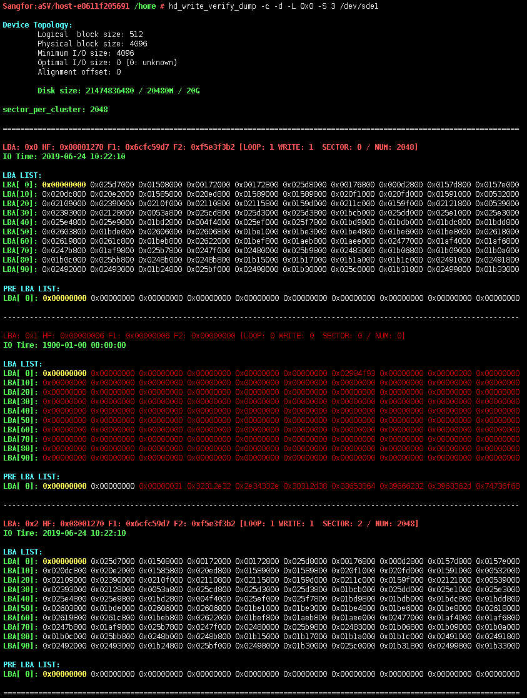
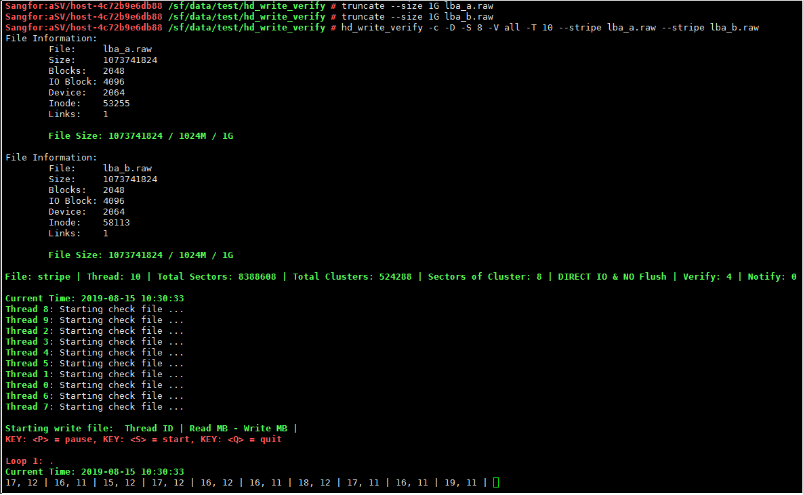
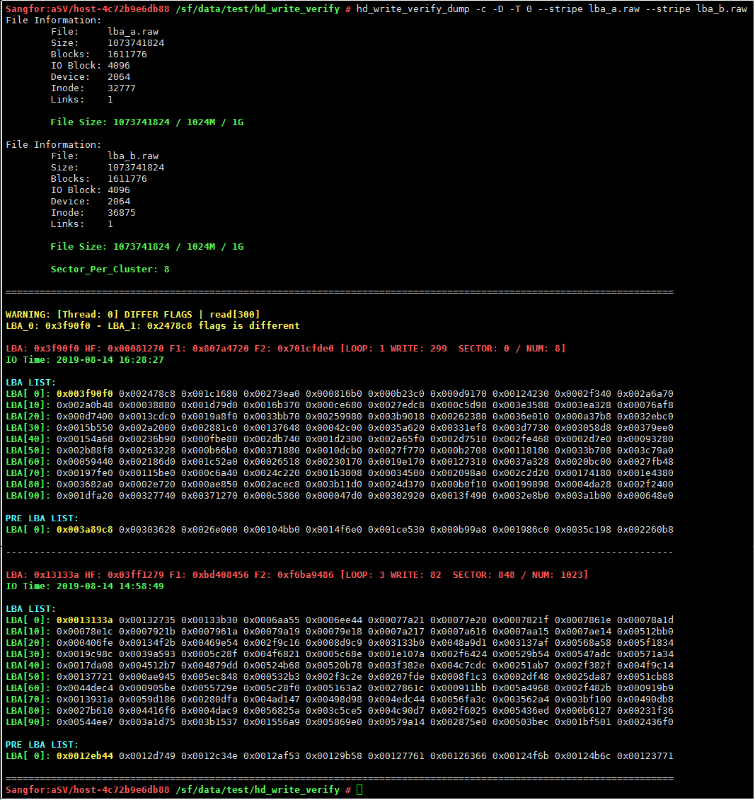
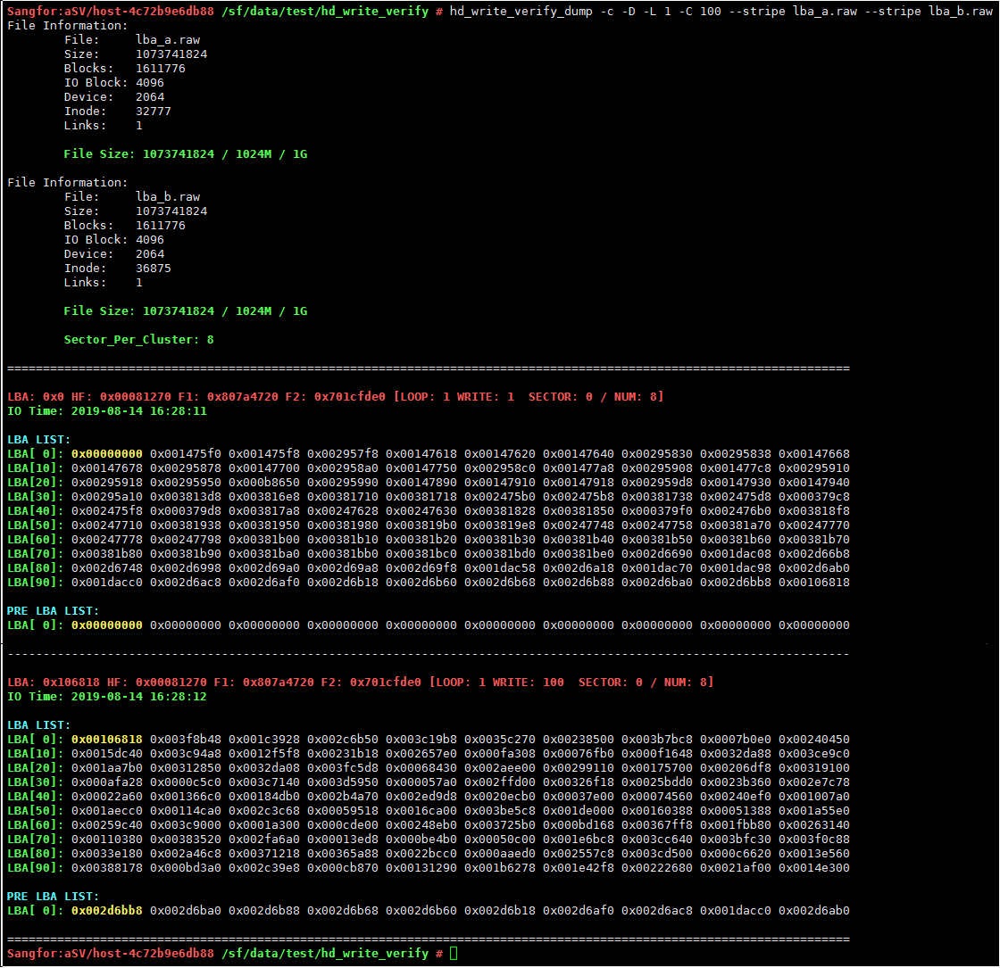
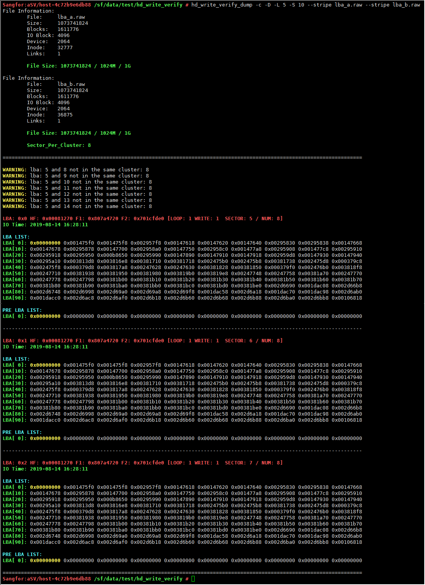
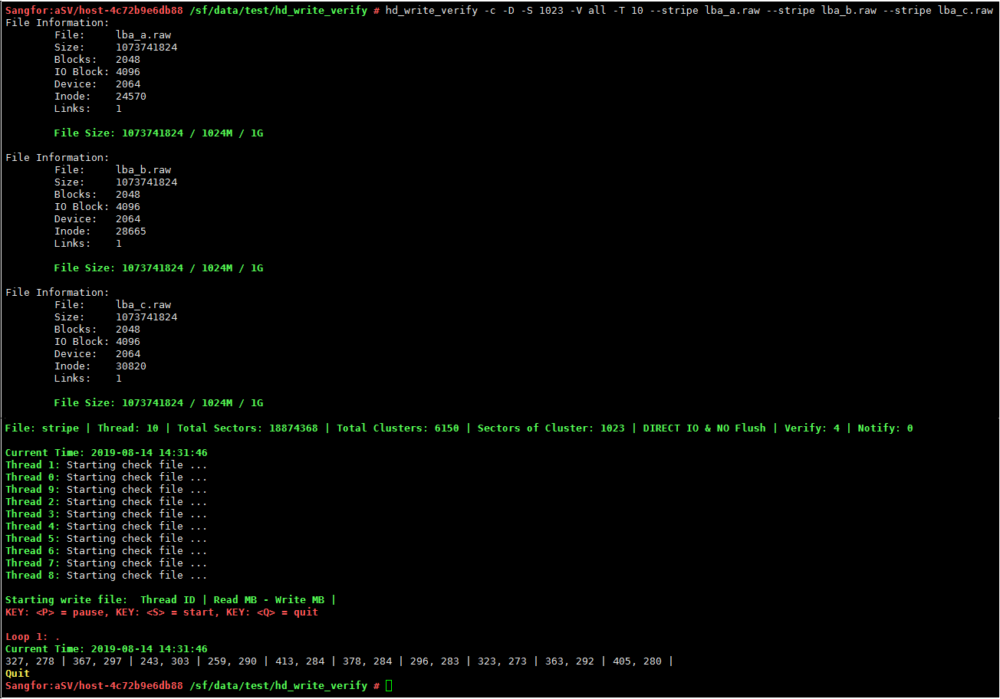

## YOUPLUS's tools

# hd_write_verify & hd_write_verify_dump
=========================================================================

Copyright (c) 2016 YOUPLUS

Author: YOUPLUS(<zhang_youjia@126.com>)

hd_write_verify & hd_write_verify_dump is a tool for testing disk stability and verifying data consistency, for example: physical disk: ide/sata/scsi/ssd/iscsi/fc/raid. virtual disk: loop/nbd/lvm/soft raid. virtual machine disk: ide/sata/scsi/virtio-blk/virtio-scsi.

## Linux版本
`hd_write_verify / hd_write_verify_dump [opts] <disk|file>`

## Test & Verify Data Layout

## Examples: (hd_write_verify)

## start & pause

## LBA Problem: BUG_001

## LBA Problem: BUG_002

## LBA Problem: BUG_003

## LBA Problem: BUG_004
.png)

## LBA Problem: BUG_005

## LBA Problem: BUG_006
.png)

## Examples: (hd_write_verify_dump)

.png)

## Windows版本

.png)

## 磁盘稳定性自动化测试

## linux文件条带测试
#linux两条带测试

#linux两条带线程数据校验

#linux两条带簇间数据校验

#linux两条带簇内数据校验

#linux三条带测试

## windows磁盘条带测试
#windows两磁盘条带测试

#windows两条带线程数据校验

#windows两条带簇间数据校验

#windows两条带簇内数据校验

#windows三条带自动化测试

