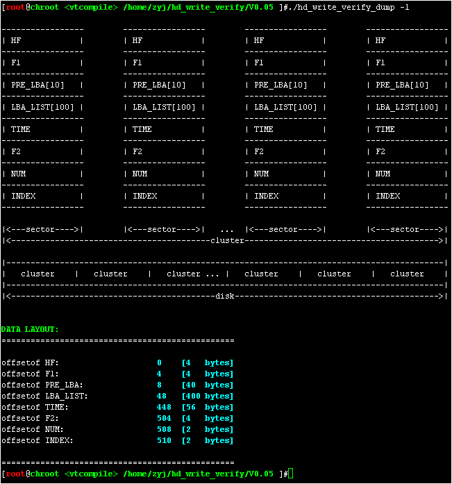
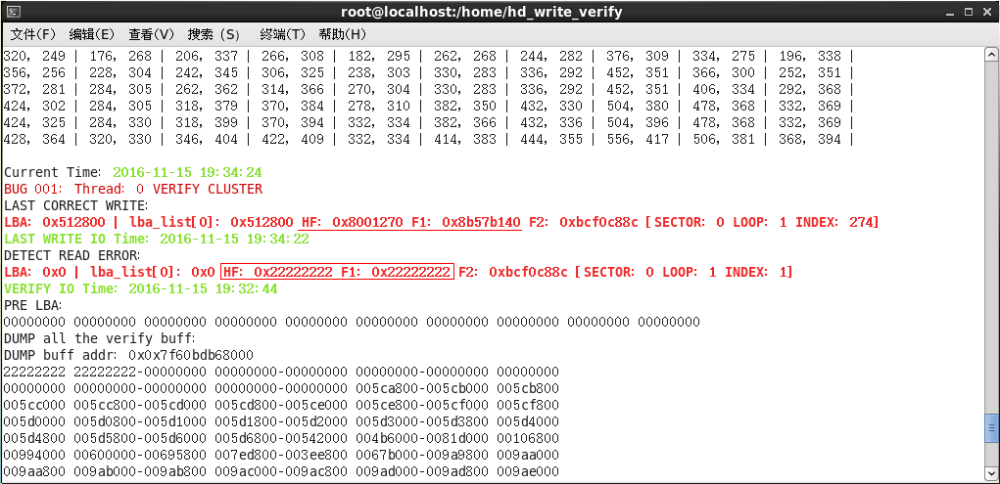
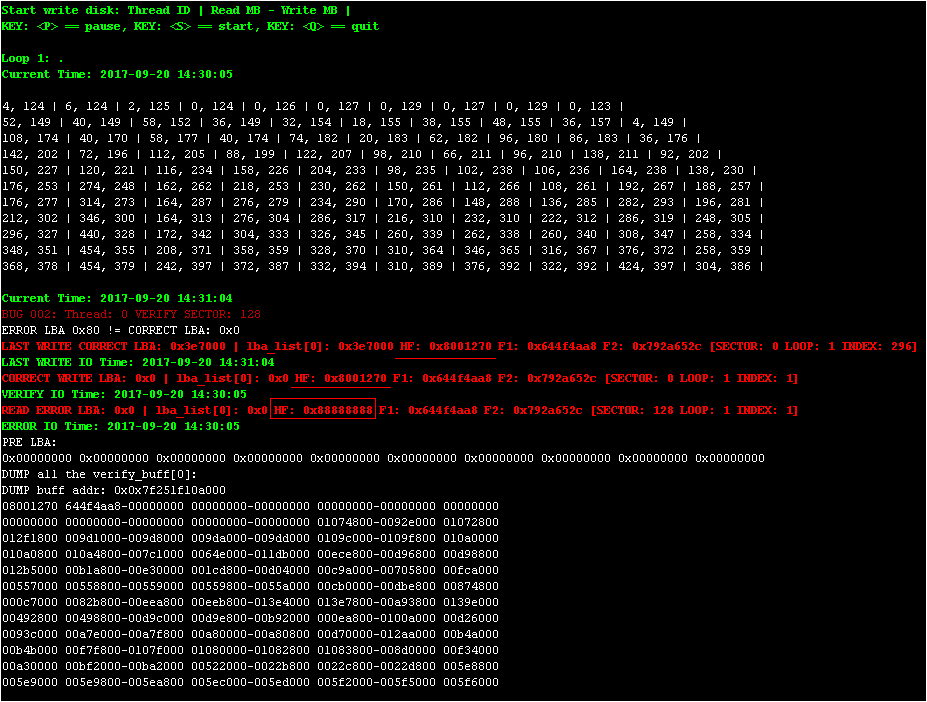
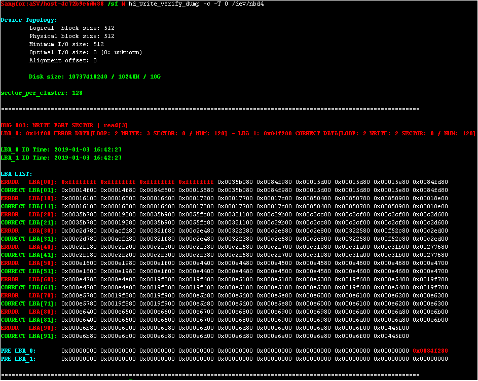
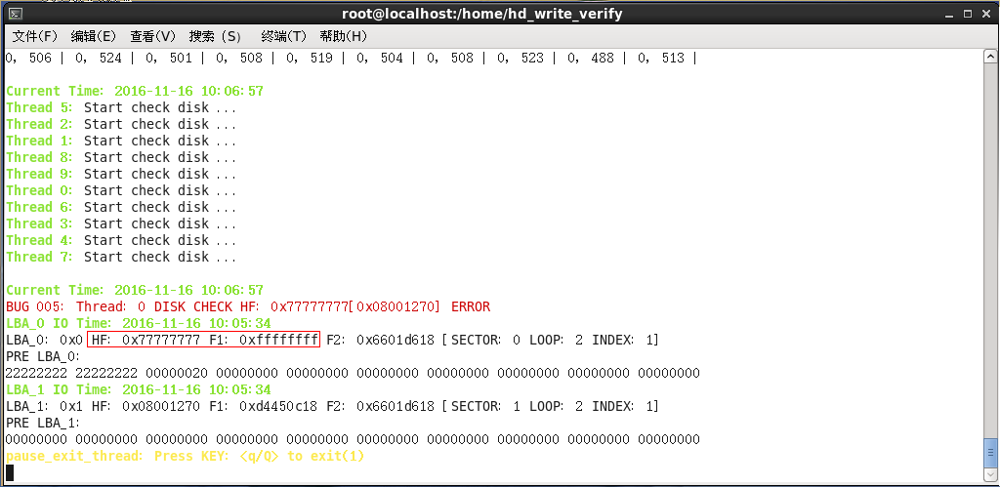
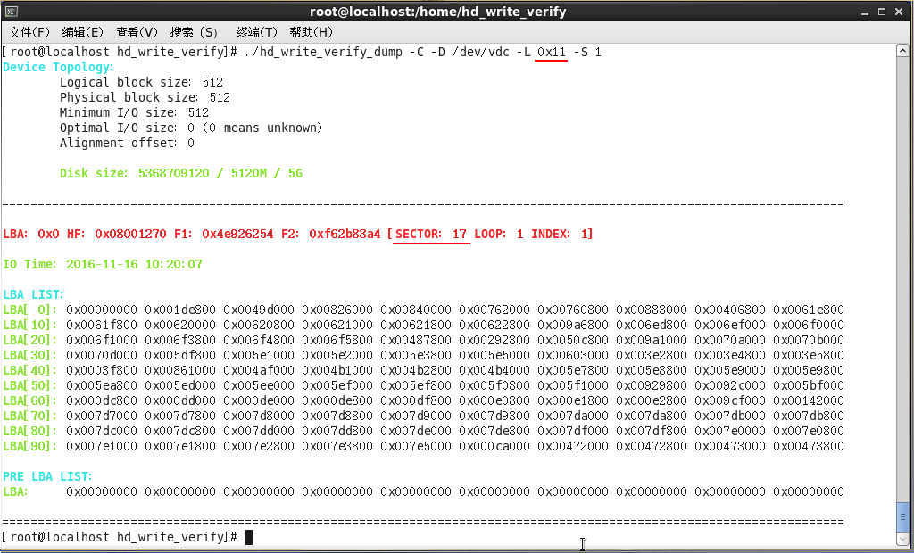

# hd_write_verify & hd_write_verify_dump
=========================================================================

Copyright (c) 2016 YOUPLUS

Author: YOUPLUS(<zhang_youjia@126.com>)

hd_write_verify & hd_write_verify_dump is a tool of testing disk stability and verifying data consistency, for example: physical disk: ide/sata/scsi/ssd/iscsi/fc/raid. virtual disk: loop/nbd/lvm/soft raid. vm disk: ide/sata/scsi/virtio-blk/virtio-scsi.

## Compile
`gcc -g -std=c99 -D_GNU_SOURCE -lpthread -lrt -o hd_write_verify hd_write_verify.h hd_write_verify.c`
`gcc -g -std=c99 -D_GNU_SOURCE -o hd_write_verify_dump hd_write_verify.h hd_write_verify_dump.c`

## Usage
`hd_write_verify / hd_write_verify_dump [opts] <disk>`

## Test & Verify Data Layout

## hd_write_verify Examples
start & pause

## LBA Problem: BUG_001

## LBA Problem: BUG_002

## LBA Problem: BUG_003

## LBA Problem: BUG_004
.png)

## LBA Problem: BUG_005

## LBA Problem: BUG_006
.png)

## hd_write_verify_dump Examples

.png)
